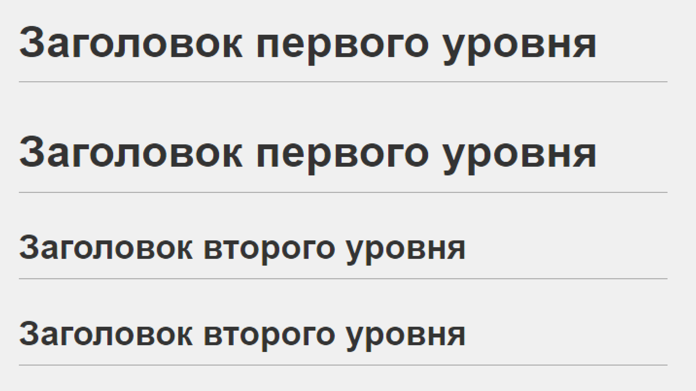

# First version control file - выделение заголовка текста

# Заголовок первого уровня
## Заголовок второго уровня ##
### Заголовок третьего уровня
#### Заголовок четвёртого уровня #
##### Заголовок пятого уровня ############
###### Заголовок шестого уровня

## Text selection - создание заголовка 

Чтобы поделить текст на параграфы, между ними нужно оставить пустую строку  
Для переноса строки внутри одного параграфа необходимо поставить более одного пробела, тспользовать обратный слеш в конце строки или испольщовать HTML-тег  

 ## Выделение текста 

*Курсив* -  выделение текста курсивом c использованием * в начале и конце строки или знаком нижнего подчеркивания _вот так_

---
 
**Полужирный**  выделение заголовка полужирным курсивом с использованием ** в начале и конце строки или __вот так__

***

Альтернативные способы выделения текста жирным или курсивом нужны для того, чтобы мы могли совмещать обы ати способа. Например *__полужирный__*

## List - обозначение списка

* Element 1 элемент ненумерованного списка выделяется * в начале строки
* Element 2
* Element 3

1. First element нумерованные списки обозначаются цифрами (числами)
2. Seconds element

## Работа с изображениями

Чтобы вставить изображение, достаточно написать следующее 

## Ссылки

Чтобы оформить ссылкой часть текста, используется такой синтаксис: [текст](ссылка). Можно сделать всплывающую подсказку при наведении курсора. Для этого в круглых скобках после ссылки нужно поставить пробел и написать текст подсказки в кавычках.
Например [второе использование контроля версий](https://gb.ru/lessons/419608)

## Цитаты

Для обозначения цитат в языке Markdown используется знак «больше» («>»). Его можно вставлять как перед каждой строкой цитаты, так и только перед первой строкой параграфа.
Например 
> Цитаты выделяются так

---

## Видео на YouTube

Ролики нельзя вставить напрямую, но можно вставить изображение со ссылкой на видео, например:

# Инструкция по работе с git

## Основные команды git

1. **git init** - создание репозитория в выбранной папке
2. **git add** - добавляет содержимое рабочего каталога в индекс (staging area) для последующего коммита.
3. **git status** - проверка статуса версий (наличия несохраненных изменений в репазитроии)
4. **git checkout** - просмотр предыдущих коммитов (с указанием конрктного коммита)
5. **git diff** - используется для вычисления разницы между любыми двумя Git деревьями. Это может быть разница между вашей рабочей копией и индексом (собственно git diff), разница между индексом и последним коммитом (git diff --staged), или между любыми двумя коммитами (git diff master branchB)
6. **git difftool**  - просто запускает внешнюю утилиту сравнения для показа различий в двух деревьях, на случай если вы хотите использовать что-либо отличное от встроенного просмотрщика git diff
7. **git commit** - берёт все данные, добавленные в индекс с помощью git add, и сохраняет их слепок во внутренней базе данных, а затем сдвигает указатель текущей ветки на этот слепок. 
8. **git reset** - используется в основном для отмены изменений.
9. **git rm** -  используется в Git для удаления файлов из индекса и рабочей копии
10. **git mv** — это всего лишь удобный способ переместить файл, а затем выполнить git add для нового файла и git rm для старого.
11. **git clean** используется для удаления мусора из рабочего каталога.

---

### Пошаговая инструкция

* Создаем рабочую папку; 
* Создаем файл в рабочей папке с нужным нам расширением;
* Командой git init создаем репозиторий в рабочей папке. Начинаем работиу с файлом;
* Командой git add добавляем в индекс рабочие файлы, готовим к коммиту; 
* Для создания коммита используем git commit -m  и оставляем меседж для быстрого восприятия версий;
* **ВСПОМИНАЕМ, ЧТО ЗАБЫЛИ СОХРАНИТЬ ВСЕ ИЗМЕНЕНИЯ В РАБОЧЕМ ФАЙЛЕ**
* Поэтому сохраняем, используем команду git add и проверяем наличие в индексе файлов, готовых к коммиту командой git status;
* Продолжаем работу с файлом, периодически создавая коммиты. Для просмотра истории созданных коммитов используем команду git log;
* Для выбра версии используем git checkout
* Чтобы увидеть разницу между созданными; версиями, используем git diff.
